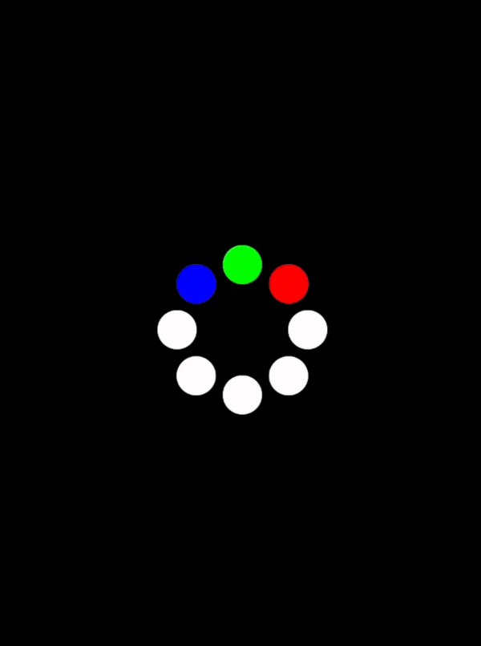
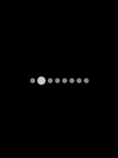

# DotLoaders

### Notice

This library is a heavily modified fork of
[DotLoadersPack-Android](https://github.com/agrawalsuneet/DotLoadersPack-Android).</br>

### Usage

To use this library, add jitpack to your project's repositories:

```groovy
maven { url "https://jitpack.io" }
```

And then add the following dependency to your build.gradle file:

```groovy
implementation 'com.github.hristogochev:dotloaders:1.0.0'
```

### Features

* 12 different dotloaders for your needs.
* Full compatibility with Jetpack Compose.
* Full compatibility with XML.

### Differences with the original

* Only available for API 21 and forward.
* Each loader is now available for Jetpack Compose.
* Additional optimizations have been applied resulting in smoother experience.
* You can now disable the automatic playing of animations and control it manually.
* Animations only play while visible, otherwise they automatically stop to save resources.
* Project has been updated to the newest Kotlin and Compose versions.
* Code has been made more maintainable by removing tight coupling and extracting common logic.
* Each loader can now be modified separately without breaking the others.

### Preview

<details>
  <summary>Bounce Loader</summary>


#### Compose implementation
```kotlin
BounceLoader(
    ballRadius = 30.dp,
    ballColor = Color.Green,
    showShadow = true,
    shadowColor = Color.LightGray,
    animDuration = 1200
)
```

#### XML implementation
```xml
<com.hristogochev.dotloaders.loaders.BounceLoader 
    android:layout_width="wrap_content"
    android:layout_height="wrap_content"
    app:bounce_ballRadius="30dp"
    app:bounce_ballcolor="@color/green"
    app:bounce_showShadow="true"
    app:bounce_shadowColor="@color/light_gray"
    app:bounce_animDuration="1200" />
```

</details>


<details>
  <summary>Classic Loader</summary>



#### Compose implementation
```kotlin
ClassicLoader(
    activeColor = Color.Red,
    inactiveColor = Color.White,
    radius = 40.dp,
    dotRadius = 12.dp,
    animDuration = 200,
    showRunningShadow = true,
    firstShadowColor = Color.Green,
    secondShadowColor = Color.Blue
)
```

#### XML implementation
```xml
<com.hristogochev.dotloaders.loaders.ClassicLoader
    android:layout_width="wrap_content"
    android:layout_height="wrap_content"
    app:classic_activeColor="@color/red"
    app:classic_inactiveColor="@color/white"
    app:classic_radius="40dp"
    app:classic_dotRadius="12dp"
    app:classic_animDuration="200" 
    app:classic_showRunningShadow="true"
    app:classic_firstShadowColor="@color/green"
    app:classic_secondShadowColor="@color/blue" />
```

</details>

<details>
  <summary>Fidget Loader</summary>


#### Compose implementation
```kotlin
FidgetLoader(
    dotRadius = 30.dp,
    drawOnlyStroke = true,
    strokeWidth = 8.dp,
    firstDotColor = Color.Red,
    secondDotColor = Color.Green,
    thirdDotColor = Color.Blue,
    distanceMultiplier = 4,
    animDuration = 500
)
```

</details>

<details>
  <summary>Lazy Loader</summary>


#### Compose implementation
```kotlin
LazyLoader(
    spacing = 5.dp,
    dotRadius = 10.dp,
    firstDotColor = Color.Red,
    secondDotColor = Color.Green,
    thirdDotColor = Color.Blue,
    animDuration = 500,
    firstDotDelay = 100,
    secondDotDelay = 200,
)
```

</details>

<details>
  <summary>Lights Loader</summary>


#### Compose implementation
```kotlin
LightsLoader(
    size = 4,
    spacing = 5.dp,
    dotRadius = 12.dp,
    dotColor = Color.Green
)
```

</details>

<details>
  <summary>Linear Loader</summary>



#### Compose implementation
```kotlin
LinearLoader(
    activeColor = Color.LightGray,
    inactiveColor = Color.Gray,
    dotRadius = 6.dp,
    dotCount = 8,
    showRunningShadow = false,
    spacing = 6.dp,
    animDuration = 200,
    singleDirection = false,
    expandLeadingDot = true,
    expandedLeadingDotRadius = 10.dp
)
```

</details>

<details>
  <summary>Pulling Loader</summary>


#### Compose implementation
```kotlin
PullingLoader(
    radius = 42.dp,
    dotRadius = 10.dp,
    dotColors = listOf(
        Color.Red,
        Color.Green,
        Color.Blue,
        Color.White,
        Color.White,
        Color.White,
        Color.White,
        Color.White
    ),
    animDuration = 2000,
)
```

</details>

<details>
  <summary>Pulsing Loader</summary>


#### Compose implementation
```kotlin
PulsingLoader(
    dotRadius = 12.dp,
    dotColor = Color.Green,
    dotCount = 6,
    spacing = 4.dp,
    animDelay = 200,
    animDuration = 1000,
)
```

</details>

<details>
  <summary>Sliding Loader</summary>


#### Compose implementation
```kotlin
SlidingLoader(
    dotRadius = 10.dp,
    firstDotColor = Color.Red,
    secondDotColor = Color.Green,
    thirdDotColor = Color.Blue,
    spacing = 6.dp,
    distanceToMove = 12,
    animDuration = 2000
)
```

</details>


<details>
  <summary>Spinning Loader</summary>


#### Compose implementation
```kotlin
SpinningLoader(
    radius = 40.dp,
    dotRadius = 10.dp,
    dotColor = Color.Green,
    animDuration = 4000
)
```

</details>

<details>
  <summary>Trailing Loader</summary>


#### Compose implementation
```kotlin
TrailingLoader(
    radius = 40.dp,
    dotRadius = 10.dp,
    dotColor = Color.Green,
    dotTrailCount = 5,
    animDelay = 200,
    animDuration = 1200
)
```

</details>

<details>
  <summary>Zee Loader</summary>


#### Compose implementation
```kotlin
ZeeLoader(
    dotRadius = 24.dp,
    firstDotColor = Color.Green,
    secondDotColor = Color.Blue,
    distanceMultiplier = 4,
    animDuration = 300
)
```

</details>