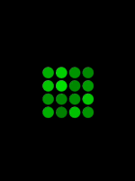
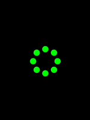

# SpinDot

### Notice

This library is a heavily modified fork of
[DotLoadersPack-Android](https://github.com/agrawalsuneet/DotLoadersPack-Android).</br>

### Usage

To use this library, add jitpack to your project's repositories:

```groovy
maven { url "https://jitpack.io" }
```

And then add the following dependency to your build.gradle file:

```groovy
implementation 'com.github.hristogochev:spindot:1.0.0'
```

### Features

* 10 different dot loaders.
* Full compatibility with Jetpack Compose.
* Full compatibility with XML.

### Differences with the original

* Only available for API 21 and forward.
* The CircularDots and LinearDots loaders are missing and will be added later.
* Each loader is now available for Jetpack Compose.
* Additional optimizations have been applied resulting in smoother experience.
* You can now disable the automatic playing of animations and control it manually.
* Animations only play while visible, otherwise they automatically stop to save resources.
* Project has been updated to the newest Kotlin and Compose versions.

### Preview

<details>
  <summary>Bounce Loader</summary>
<br>


#### Compose implementation

```kotlin
BounceLoader(
    ballRadius = 30.dp,
    ballColor = Color.Green,
    showShadow = true,
    shadowColor = Color.LightGray,
    animDuration = 1200
)
```

#### XML implementation

```xml

<com.hristogochev.spindot.loaders.BounceLoader 
    android:layout_width="wrap_content"
    android:layout_height="wrap_content" 
    app:bounce_ballRadius="30dp"
    app:bounce_ballcolor="@color/green" 
    app:bounce_showShadow="true"
    app:bounce_shadowColor="@color/light_gray" 
    app:bounce_animDuration="1200" />
```

</details>


<details>
  <summary>Fidget Loader</summary>
<br>


#### Compose implementation

```kotlin
FidgetLoader(
    dotRadius = 30.dp,
    drawOnlyStroke = true,
    strokeWidth = 8.dp,
    firstDotColor = Color.Red,
    secondDotColor = Color.Green,
    thirdDotColor = Color.Blue,
    distanceMultiplier = 4,
    animDuration = 500
)
```

#### XML implementation

```xml

<com.hristogochev.spindot.loaders.FidgetLoader 
    android:layout_width="wrap_content"
    android:layout_height="wrap_content" 
    app:fidget_dotRadius="30dp"
    app:fidget_drawOnlyStroke="true" 
    app:fidget_strokeWidth="8dp"
    app:fidget_firstDotColor="@color/red" 
    app:fidget_secondDotColor="@color/green"
    app:fidget_thirdDotColor="@color/blue" 
    app:fidget_distanceMultiplier="4"
    app:fidget_animDuration="500" />
```

</details>

<details>
  <summary>Lazy Loader</summary>
<br>


#### Compose implementation

```kotlin
LazyLoader(
    spacing = 5.dp,
    dotRadius = 10.dp,
    firstDotColor = Color.Red,
    secondDotColor = Color.Green,
    thirdDotColor = Color.Blue,
    animDuration = 500,
    firstDotDelay = 100,
    secondDotDelay = 200,
)
```

#### XML implementation

```xml

<com.hristogochev.spindot.loaders.LazyLoader 
    android:layout_width="wrap_content"
    android:layout_height="wrap_content" 
    app:lazy_spacing="5dp" 
    app:lazy_dotRadius="10dp"
    app:lazy_firstDotColor="@color/red" 
    app:lazy_secondDotColor="@color/green"
    app:lazy_thirdDotColor="@color/blue" 
    app:lazy_animDuration="500" 
    app:lazy_firstDotDelay="100"
    app:lazy_secondDotDelay="200" />
```

</details>

<details>
  <summary>Lights Loader</summary>
<br>



#### Compose implementation

```kotlin
LightsLoader(
    size = 4,
    spacing = 5.dp,
    dotRadius = 12.dp,
    dotColor = Color.Green
)
```

#### XML implementation

```xml

<com.hristogochev.spindot.loaders.LightsLoader 
    android:layout_width="wrap_content"
    android:layout_height="wrap_content" 
    app:lights_size="4" 
    app:lights_spacing="5dp"
    app:lights_dotRadius="12dp" 
    app:lights_dotColor="@color/green" />
```

</details>


<details>
  <summary>Pulling Loader</summary>
<br>


#### Compose implementation

```kotlin
PullingLoader(
    radius = 42.dp,
    dotRadius = 10.dp,
    dotColors = listOf(
        Color.Red,
        Color.Green,
        Color.Blue,
        Color.White,
        Color.White,
        Color.White,
        Color.White,
        Color.White
    ),
    animDuration = 2000,
)
```

#### XML implementation

```xml

<com.hristogochev.spindot.loaders.PullingLoader 
    android:layout_width="wrap_content"
    android:layout_height="wrap_content"
    app:pulling_radius="42dp"
    app:pulling_dotRadius="10dp"
    app:pulling_dotColors="@array/dot_colors" 
    app:pulling_animDuration="2000" />
```

</details>

<details>
  <summary>Pulsing Loader</summary>
<br>


#### Compose implementation

```kotlin
PulsingLoader(
    dotRadius = 12.dp,
    dotColor = Color.Green,
    dotCount = 6,
    spacing = 4.dp,
    animDelay = 200,
    animDuration = 1000,
)
```

#### XML implementation

```xml

<com.hristogochev.spindot.loaders.PulsingLoader 
    android:layout_width="wrap_content"
    android:layout_height="wrap_content"
    app:pulsing_dotRadius="12dp"
    app:pulsing_dotColor="@color/green" 
    app:pulsing_dotCount="6" 
    app:pulsing_spacing="4dp"
    app:pulsing_animDelay="200"
    app:pulsing_animDuration="1000" />
```

</details>

<details>
  <summary>Sliding Loader</summary>
<br>


#### Compose implementation

```kotlin
SlidingLoader(
    dotRadius = 10.dp,
    firstDotColor = Color.Red,
    secondDotColor = Color.Green,
    thirdDotColor = Color.Blue,
    spacing = 6.dp,
    distanceToMove = 12,
    animDuration = 2000
)
```

#### XML implementation

```xml

<com.hristogochev.spindot.loaders.SlidingLoader 
    android:layout_width="wrap_content"
    android:layout_height="wrap_content"
    app:sliding_dotRadius="10dp"
    app:sliding_firstDotColor="@color/red"
    app:sliding_secondDotColor="@color/green"
    app:sliding_thirdDotColor="@color/blue" 
    app:sliding_spacing="6dp"
    app:sliding_distanceToMove="12"
    app:sliding_animDuration="2000" />
```

</details>


<details>
  <summary>Spinning Loader</summary>
<br>



#### Compose implementation

```kotlin
SpinningLoader(
    radius = 40.dp,
    dotRadius = 10.dp,
    dotColor = Color.Green,
    animDuration = 4000
)
```

#### XML implementation

```xml

<com.hristogochev.spindot.loaders.SpinningLoader 
    android:layout_width="wrap_content"
    android:layout_height="wrap_content" 
    app:spinning_radius="40dp"
    app:spinning_dotRadius="10dp"
    app:spinning_dotColor="@color/green" 
    app:spinning_animDuration="4000" />
```

</details>

<details>
  <summary>Trailing Loader</summary>
<br>


#### Compose implementation

```kotlin
TrailingLoader(
    radius = 40.dp,
    dotRadius = 10.dp,
    dotColor = Color.Green,
    dotTrailCount = 5,
    animDelay = 200,
    animDuration = 1200
)
```

#### XML implementation

```xml

<com.hristogochev.spindot.loaders.TrailingLoader 
    android:layout_width="wrap_content"
    android:layout_height="wrap_content"
    app:trailing_radius="40dp"
    app:trailing_dotRadius="10dp"
    app:trailing_dotColor="@color/green"
    app:trailing_dotTrailCount="5" 
    app:trailing_animDelay="200"
    app:trailing_animDuration="1200" />
```

</details>

<details>
  <summary>Zee Loader</summary>
<br>


#### Compose implementation

```kotlin
ZeeLoader(
    dotRadius = 24.dp,
    firstDotColor = Color.Green,
    secondDotColor = Color.Blue,
    distanceMultiplier = 4,
    animDuration = 300
)
```

#### XML implementation

```xml

<com.hristogochev.spindot.loaders.ZeeLoader 
    android:layout_width="wrap_content"
    android:layout_height="wrap_content" 
    app:zee_dotRadius="24dp"
    app:zee_firstDotColor="@color/green"
    app:zee_secondDotColor="@color/blue"
    app:zee_distanceMultiplier="4"
    app:zee_animDuration="300" />
```

</details>

### License

Licensed under [Apache-2.0 license](https://github.com/hristogochev/spindot/blob/master/LICENSE).